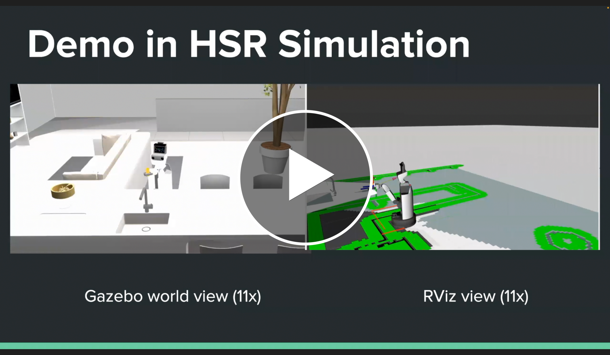
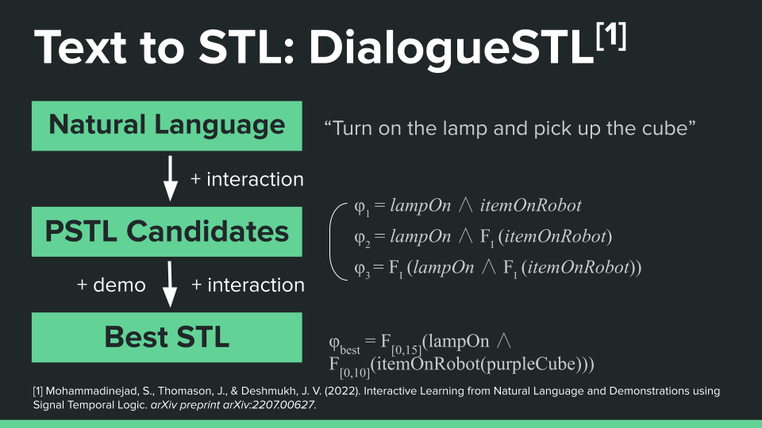
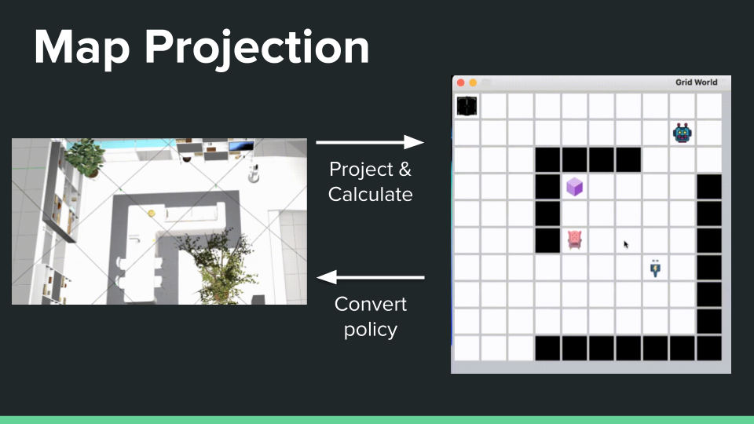
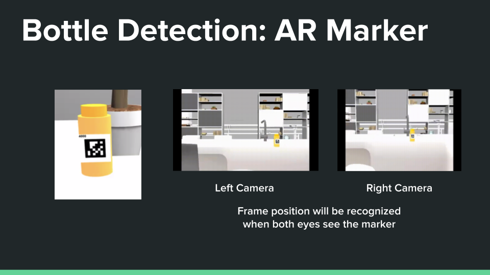

# JARGO
Just Another Robot Grabbing Object

J.A.R.G.O is a [CSCI-513 Autonomous Cyber-Physical System](https://jdeshmukh.github.io/teaching/cs513-autocps-fall-2022/index.html) group project.

Commanding the Toyota HSR to pick up object using text commands.

# Project Showcase & Demo

# Motivation
Helping people with limited motor functions has always been a target use case for the robotics field. However, using traditional control methods usually requires professoinal training. In this project, we use the Toyota Human Support Robot (HSR) as the platform, and implemented a way to **use textual instrucitons to command the robot** for simple tasks like fetching an object.

# Understanding Textual Instructions
Natural language commands usually contains ambiguities and cannot be understood directly by computers. In cyber-physical systems, Signal Temporal Logic (STL)is a way to formalize control properties with time constraints. For conversion from natural language commands to STLs, we used [DialogueSTL](https://arxiv.org/abs/2207.00627). 

DialogueSTL takes in text commands, processes the natural language, and generates Parametric STL (PSTL) candidates. DialogueSTL will then ask the user for a demonstration. Together with questions asked to the user to resolve ambiguities, DialogueSTL uses robustness as a benchmark to select the final STL (or Best STL) as output.

# Learning Optimal Policy
We used neural networks with Q-Learning for generating the optimal policy. For modeling the reward function, our Deep RL model used the robustness of an STL formula, or the signed distance of a given trajectory from satisfying or violating a given formula.

# Map Projection & Policy Conversion
For reducing computation and complexity, we projected the Gazebo world used by the HSR simulator, to a 2D grid world, one that’s similar to what is used in the DialogueSTL demo. 

We generate the optimal policy on the 2d grid world, and then convert it back to the Gazebo world, to command the HSR to move from start state to goal state.

# Object Detection, Pose Estimation Using AR Marker
For detecting the bottle and moving the end effector to grab it, we used an AR marker stuck to the bottle. 

The frame position can be calculated when the marker can be seen in both of the head cameras. When the AR marker frame position is acquired, we can move the end effector around the bottle and apply the grip.

# Future Work
- We can use well-trained vision models (like YOLOv5) in addition to AR markers for object detection, this will enable our robot to recognize not only known/predefined objects, but also objects not previously specified.

- Since DialogueSTL uses natural language for input and asking questions, our work can also be extended to a voice-based system by implementing speech-to-text and Text-to-Speech.
